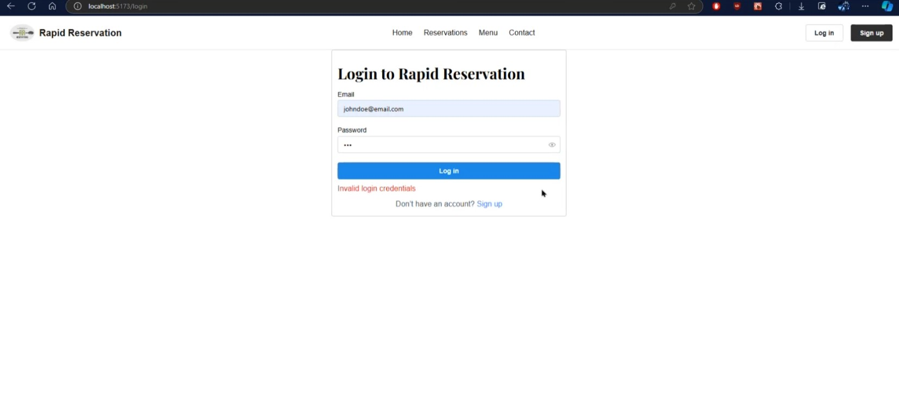

# Feature Descriptions

## User Registration
**Feature Description**: The user registration feature allows new customers to create an account by providing personal details, ensuring they can securely log in and access services such as table reservations, pre-ordering, and receiving updates. This feature aims to simplify the onboarding process, validate user input, and enhance security by ensuring the uniqueness of each account.
 - Key Functionalities:
   - Input Fields: Users must provide essential details, including name, email, phone number, and password.
   - Password Validation: The system enforces password strength by requiring a combination of letters, numbers, and special characters.
   - Email Validation: The system checks for a valid email format and ensures it is not already in use.
   - Phone Number Validation: A valid phone number format is required, with optional two-factor authentication for security.
   - Unique Account Creation: The system ensures that each email and phone number is associated with only one account.
   - Confirmation: Upon successful registration, users receive a confirmation email or SMS to verify their account.
 - Acceptance Criteria:
   1. The user must be able to input their name, email, phone number, and password to register.
   2. The system should validate email and phone number formats before allowing registration.
   3. Passwords must meet strength requirements (e.g., minimum 8 characters, including numbers and symbols).
   4. Duplicate email or phone numbers should prompt an error message, preventing multiple registrations.
   5. A verification email or SMS should be sent to confirm the registration process.
   6. After successful registration, users are redirected to their account dashboard.
      

## Login Functionality
**Feature Description**: The login functionality enables registered users to securely access their accounts by entering their credentials. This feature ensures that only authorized users can access sensitive functionalities such as reservations, order management, and personal preferences. It also provides error handling for incorrect credentials and supports advanced security measures to protect user data.
 - Key Functionalities:
   - Username/Email Input: Users can log in using their registered username or email address.
   - Password Input: Users must provide a valid password to authenticate.
   - Password Encryption: User passwords are securely encrypted during storage and transmission.
   - Authentication and Authorization: The system verifies the entered credentials against stored records and grants access to the user's account upon successful login.
   - Error Handling: Displays error messages for incorrect username, email, or password, such as "Invalid email/password" or "Account not found."
     
   - Forgot Password Option: Users can recover or reset their password via email if forgotten, ensuring smooth account recovery.
   - Security Features:
     - Protection against brute force attacks by limiting the number of failed login attempts (e.g., account lock after multiple failures).
 - Acceptance Criteria:
   1. The user must be able to input their username/email and password.
   2. The system should authenticate the user and grant access to their account if the credentials are correct.
   3. Error messages should be displayed for invalid credentials or missing input fields.
   4. Users should have the option to reset their password if they forget it.
   5. Optional two-factor authentication should be supported for added security.
   6. After successful login, the user should be redirected to their account dashboard.
   7. Failed login attempts should result in account lock after a configurable number of tries, with a message to contact support or unlock via email.
