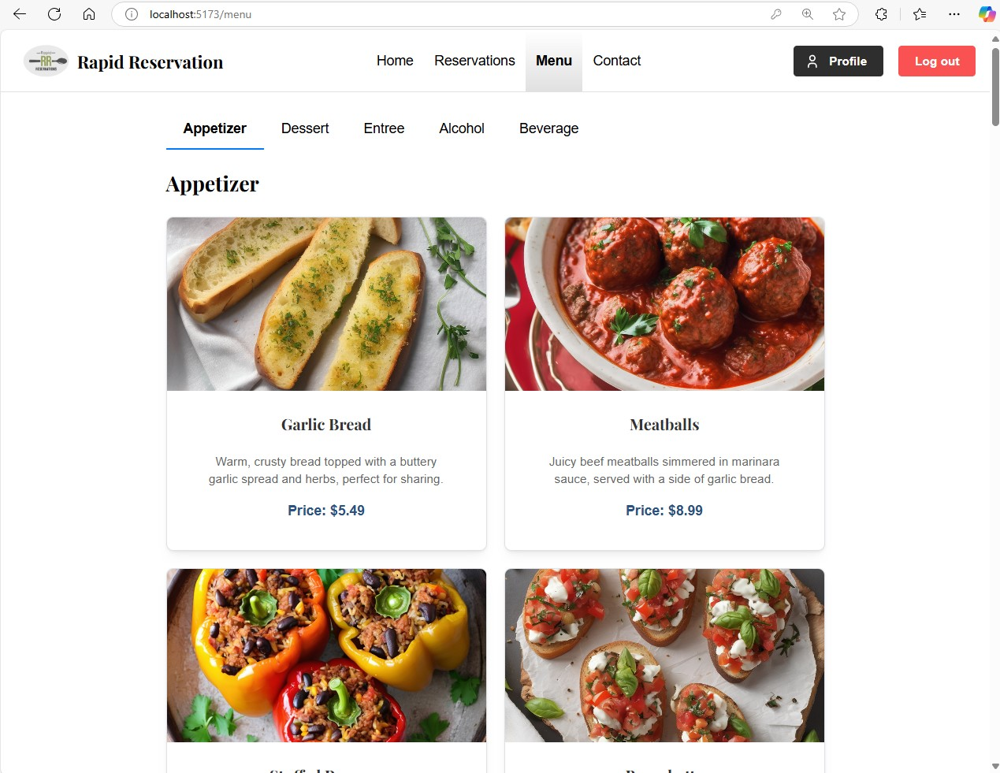

# User Guide: How to Navigate the Menu Page
This guide explains how to navigate the restaurant’s menu page, which is organized into tabs for different types of food and beverages. The menu allows you to explore appetizers, desserts, entrees, alcoholic drinks, and non-alcoholic beverages with detailed descriptions, images, and prices.

## Step-by-Step Instructions for Navigating the Menu
1. Access the Menu Page
  - On the restaurant’s website, navigate to the menu by selecting the “Menu” option in the main navigation bar or from the homepage.
2. Understanding the Menu Layout
The menu is divided into several tabs to make it easy to browse specific categories of items:
  - Appetizer
  - Dessert
  - Entree
  - Alcohol
  - Beverage
Each tab contains a list of items under that category with pictures, descriptions, and prices.

## Menu Tabs Overview
A. Appetizer
  - What to Expect: This section showcases the restaurant’s starters and small plates, such as breads, meatballs, and handheld snacks.
  - How to Use:
    - Click on the “Appetizer” tab at the top of the menu page.
    - Scroll through the list of available appetizers, each displaying:
      - Image of the dish.
      - Description detailing ingredients or preparation style.
      - Price for each item.
