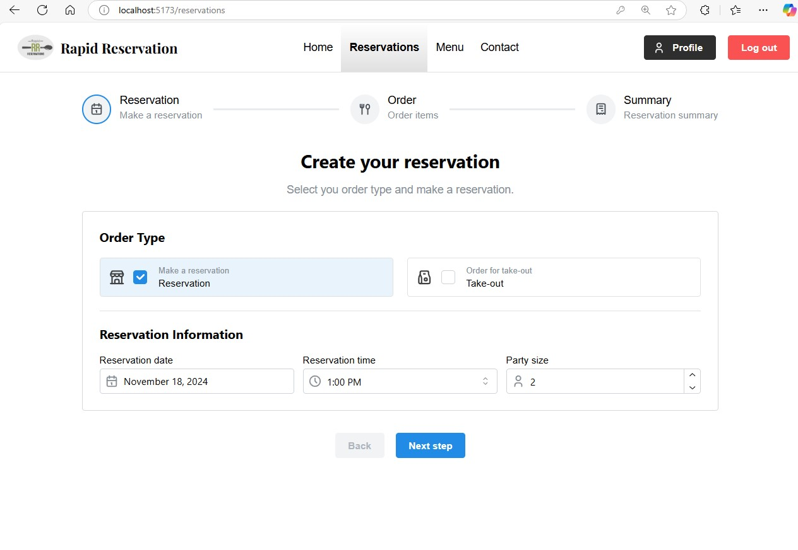
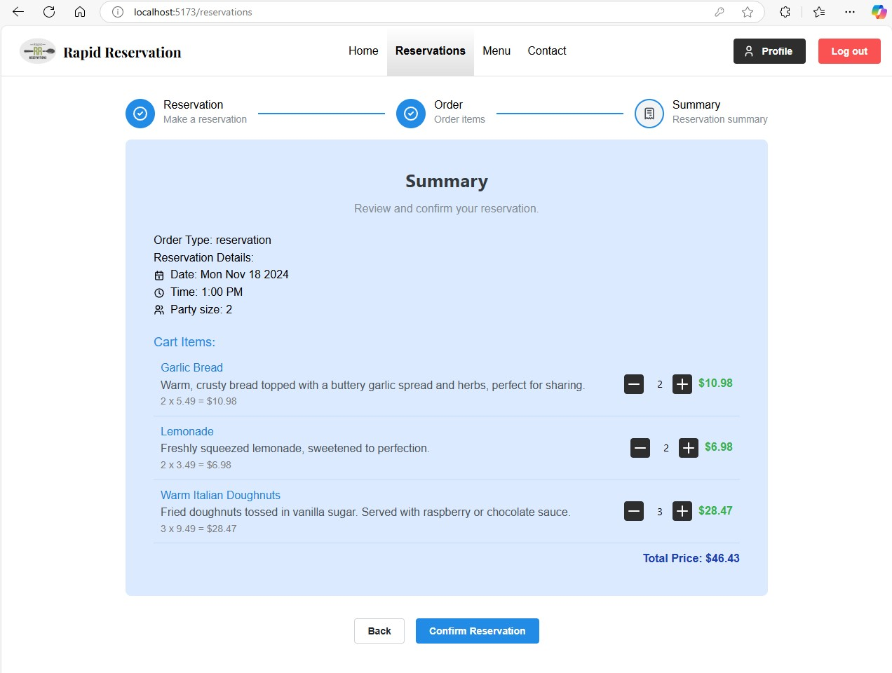
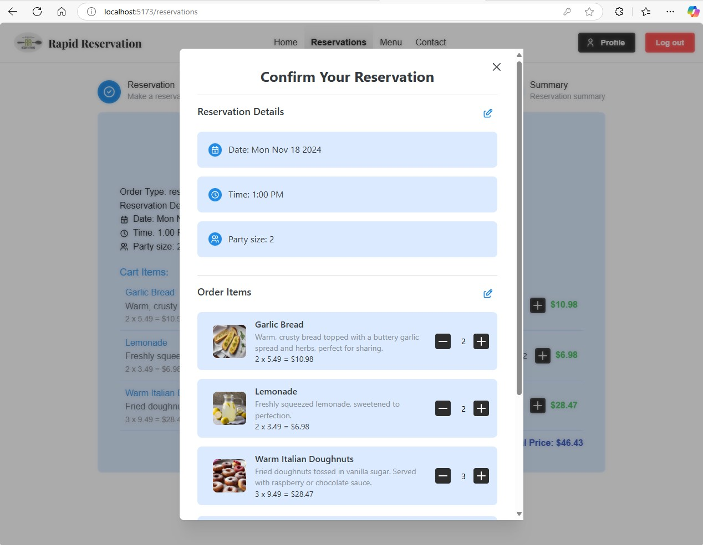

# User Guide for the Reservation Feature

Welcome to the Rapid Reservation system! This guide will walk you through using the reservation page to seamlessly book a table at our restaurant. With real-time table availability, time slot selection, and the option to place orders in advance, our reservation system provides a smooth, interactive experience.
## Accessing the Reservation Page
On the reservation page, you can:
  - Make your Reservation
  - Order Items
  - View Reservation Summary

 - Key Functionalities:
   - Dine-in/Take-out Availability: User will be presented with the option on a dine-in or take-out reservation.
   - Time Slot Selection: Customers can choose a specific time slot for their reservation based on availability.
   - Order Placing: User can add their orders while making reservations up to party size of 10.
   - Reservation Confirmation: After choosing a time, the system displays a summary of the reservation, including the date, time, and party size, for final confirmation.
     
 - Acceptance Criteria:
   1. The user must be able to view available tables on a visual seating layout.
   2. The system should allow users to select a time slot and reserve a specific table.
   3. After completing the reservation, the system should display a confirmation screen with all details.
   4. The system should allow users to modify or cancel their reservation.
      
   6. Special requests should be captured during the reservation process and flagged for staff.
