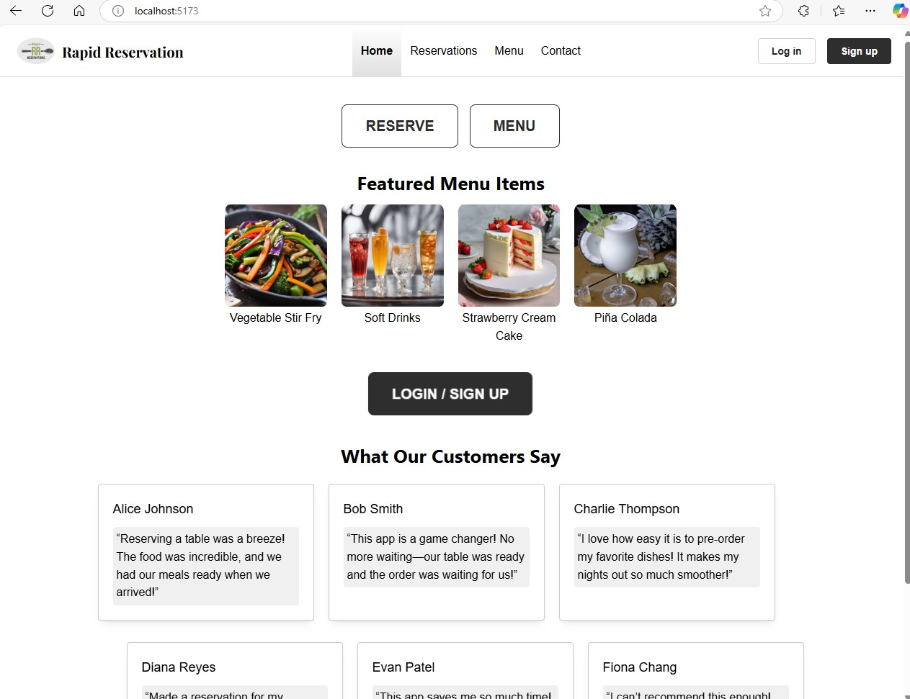
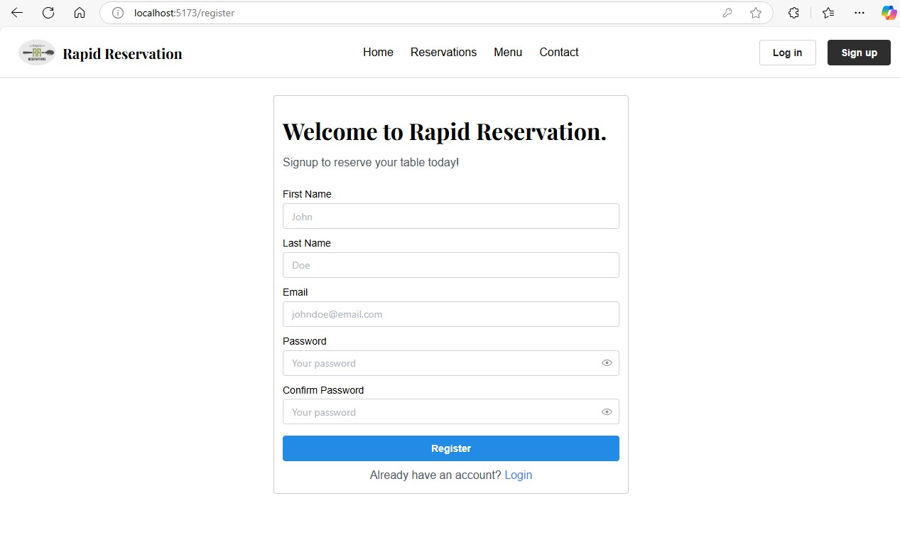

# User Guide: How to Register for an Account
This guide walks you through the process of registering a new user account for Rapid Reservation. Follow these simple steps to create your account and access all features, such as making table reservations, pre-ordering food, and receiving updates about your orders.

## Step-by-Step Instructions for User Registration
1. Navigate to the Registration Page
  - Open your web browser and go to the restaurant’s website.
  - On the homepage, click on the "Login/Sign Up" button or "Sign up" option located on the navigation bar at top.
    
2. Enter Personal Information
  - On the registration form, you will be asked to provide the following details:
    - Full Name: Enter your first and last name.
    - Email Address: Provide a valid email address. This will be used for login and communication (e.g., reservations, order updates).
    - Password: Create a strong password with at least 8 characters, including a combination of letters, numbers, and symbols.
    - Confirm Password: Re-enter the password to ensure it matches.
      
3. Submit the Registration
  - Once all fields are filled out correctly, click the “Register” or “Sign Up” button at the bottom of the form.
4. Login to Your Account
  - Once verified, return to the website’s login page.
  - Enter your registered email and password to log in.
      
## FAQs
1. Can I change my email or phone number after registering?
Yes, you can update your email or phone number by visiting your account settings after logging in.

2. What should I do if I forget my password?
If you forget your password, click on the "Forgot Password" link on the login page. You will receive an email or SMS to reset your password.

## Contact Support
If you encounter any issues during the registration process or need further assistance, please contact our customer support team at rapidreservation@email.com or call 123-456-7890.
