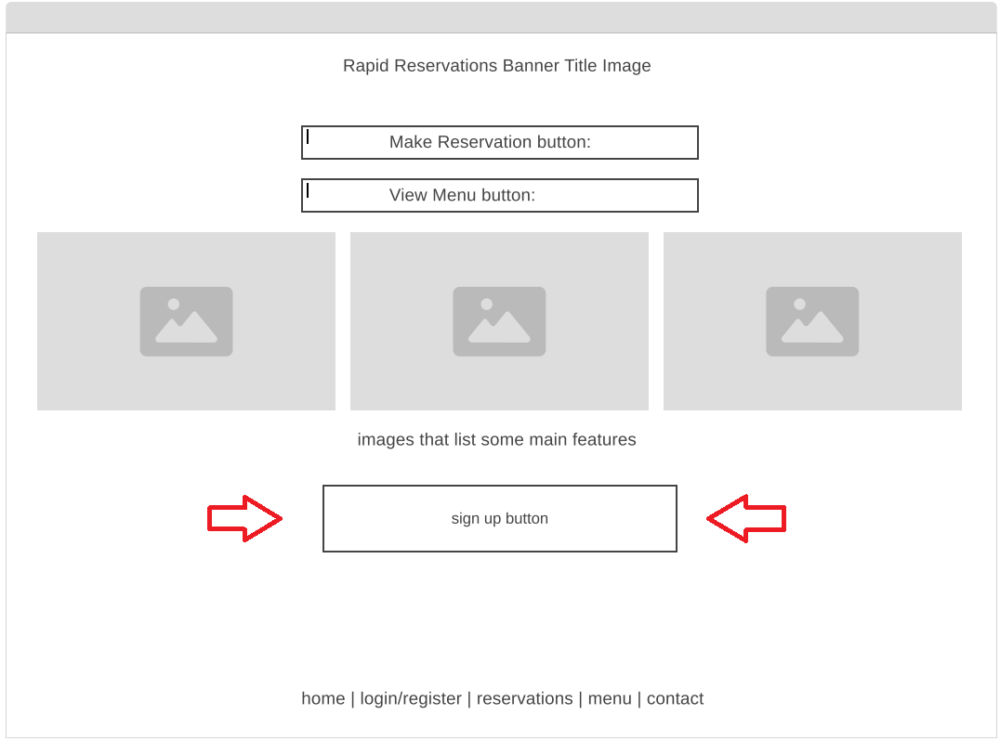

# User Guide: How to Register for an Account
This guide walks you through the process of registering a new user account for Rapid Reservation. Follow these simple steps to create your account and access all features, such as making table reservations, pre-ordering food, and receiving updates about your orders.

## Step-by-Step Instructions for User Registration
1. Navigate to the Registration Page
  - Open your web browser and go to the restaurant’s website.
  - On the homepage, click on the "Sign Up" or "Register" button, located at the bottom of the page.
    
2. Enter Personal Information
  - On the registration form, you will be asked to provide the following details:
    - Full Name: Enter your first and last name.
    - Email Address: Provide a valid email address. This will be used for login and communication (e.g., reservations, order updates).
    - Phone Number: Input your mobile number. This is optional but may be required for two-factor authentication or SMS notifications.
    - Password: Create a strong password with at least 8 characters, including a combination of letters, numbers, and symbols.
    - Confirm Password: Re-enter the password to ensure it matches.
      
3. Agree to Terms and Conditions
  - Review the platform’s Terms of Service and Privacy Policy.
  - Check the box that confirms you agree to these terms before proceeding.
4. Complete CAPTCHA (if applicable)
  - You may be asked to complete a CAPTCHA to verify that you are not a robot. Follow the on-screen instructions to pass the CAPTCHA.
5. Submit the Registration
  - Once all fields are filled out correctly, click the “Register” or “Sign Up” button at the bottom of the form.
6. Verify Your Email (or Phone Number)
  - After submitting the form, you will receive a verification email or SMS, depending on the information you provided during registration.
    - Email Verification:
      - Check your inbox for a confirmation email.
      - Click on the verification link within the email to activate your account.
    - SMS Verification (if applicable):
      - If you opted for SMS verification, you will receive a text message with a verification code.
      - Enter the code on the verification page to complete the process.
7. Login to Your Account
  - Once verified, return to the website’s login page.
  - Enter your registered email/phone number and password to log in.
8. Optional: Complete Your Profile
  - After logging in, you may be prompted to set up your profile further. This includes adding:
    - Dietary Preferences: (e.g., vegan, gluten-free)
    - Seating Preferences: (e.g., window seat, outdoor dining)
    - Notification Preferences: Choose whether you prefer to receive updates via email or SMS.
## Troubleshooting Common Issues

**I didn’t receive the verification email/SMS**
  - Check your spam/junk folder: The verification email may have been filtered.
  - Resend the verification email: On the registration page, there should be an option to resend the verification link or SMS.
  - Ensure correct email/phone number: Double-check that the details you entered during registration are correct.
**My password doesn’t meet the strength requirements**
  - Ensure your password:
    - Is at least 8 characters long.
    - Contains at least one uppercase letter, one lowercase letter, one number, and one special character (e.g., @, #, $, !).
**I received an error message saying “Email/Phone Number already in use”**
  - This error means that the email or phone number you’re trying to register with is already linked to an existing account.
    - Solution: Try resetting the password for that account or use a different email/phone number.
      
## FAQs
1. Is it mandatory to provide my phone number during registration?
No, providing a phone number is optional. However, it may be necessary for two-factor authentication or receiving SMS notifications for your reservations and orders.

2. Can I change my email or phone number after registering?
Yes, you can update your email or phone number by visiting your account settings after logging in.

3. What should I do if I forget my password?
If you forget your password, click on the "Forgot Password" link on the login page. You will receive an email or SMS to reset your password.

## Contact Support
If you encounter any issues during the registration process or need further assistance, please contact our customer support team at rapidr-support@rreservation.com or call 1-800-123-4567.
