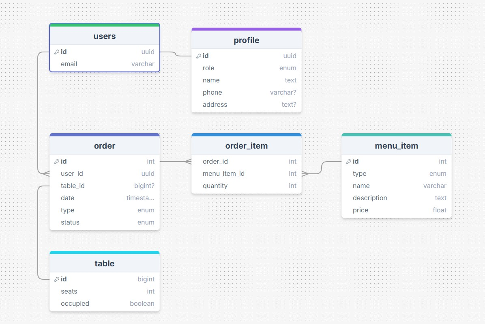
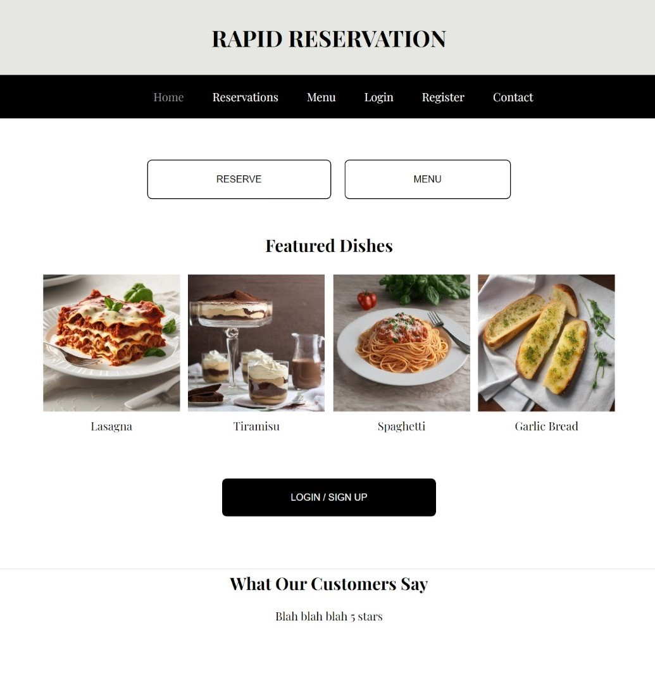

# Sprint Meeting Summary
- Date: Tuesday 10/1/2024
- Duration: 12 minutes
- Attendees: Kevin Hernandez Gaspar, Asra Khalid, Dalton Perkins, Jason Lee, Haley Simmons-Happ, Jonathan Asfoury

## Key Updates:
 ### Mockups:
  - Database Schema:
    - Dalton presented the initial database schema, which includes users, profiles, orders, menu items, and tables. Kevin and the team reviewed and approved the structure.
      
  - Current Progress:
    - Kevin has started implementing basic components for the menu UI, user profile, user registration, and Supabase integration.
      
    - Haley is working on detailed mockups for the user registration, login, and menu pages. She will also create a user profile mockup, as it was missing, and plans to have it completed by tonight or tomorrow afternoon.
  - Component Development:
    - Team members are encouraged to work on components using hardcoded data while Dalton finalizes the database and Supabase API setup.
    - Roger will handle the user profile section once the mockup is available. He plans to start working on it later in the week due to other commitments.
  - Next Steps:
    - Haley will provide the user profile mockup, and Kevin will handle the CSS styling for the components.
    - The team will meet again on Thursday to review progress.
 ## Action Items:
  - Haley: Complete the user profile mockup and share it with the team by tomorrow afternoon.
  - Roger: Begin working on the user profile section once the mockup is available.
  - Dalton: Continue working on the database and Supabase API integration.
 ## Next Meeting:
  - Date: Thursday 
