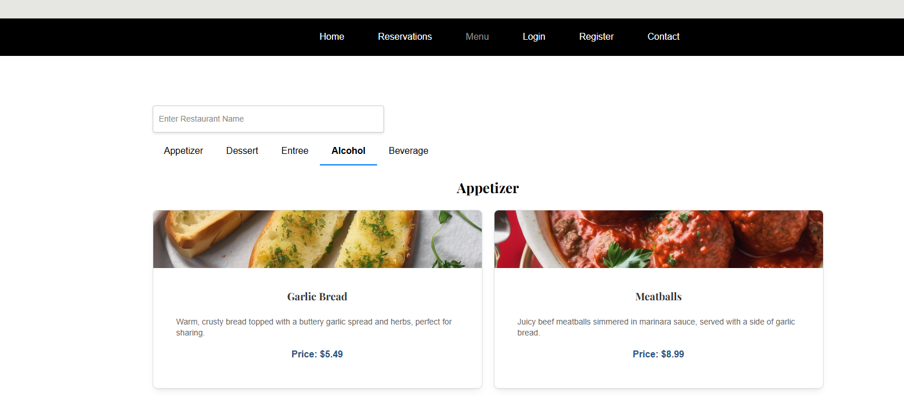

# Sprint Meeting Summary
- Date: Tuesday 10/8/2024
- Duration: 12 minutes
- Attendees: Kevin Hernandez Gaspar, Dalton Perkins, Asra Khalid, JP Asfoury, Jason Lee

## Key Updates:
  - Task Assignments:
    - Haley: Responsible for designing the reservation logo and conducting user experience testing by navigating through the app to provide feedback on the usability of each page.
    - Jason: Documenting the features implemented during the previous sprint.
    - Jonathan: Finalizing the login and registration UI using the specified components based on the project’s Software Requirements Specification (SRS).
  - Component Implementation:
    - Kevin has started implementing basic components for the menu UI, user profile, user registration, and Supabase integration.
    - Haley is working on detailed mockups for the user registration, login, and menu pages. She will also create a user profile mockup, as it was missing, and plans to have it completed by tonight or tomorrow afternoon.
  - Component Development:
    - Dalton and Kevin discussed using React's state management for sharing data between components, ensuring ease of navigation and functionality across different parts of the application (e.g., adding items to the cart and returning to the menu).
  - Environment File Setup:
    - Dalton explained the importance of creating a .env file for storing sensitive information (like API keys) locally to enhance security and prevent exposing these details in the repository.
 ## Action Items:
  - Haley: Proceed with user experience testing and report any usability improvements needed.
  - Jason: Complete the documentation for the features implemented in the past sprint.
  - Jonathan: Finalize the login and registration UI components.
  - Team members should create a .env file locally for API keys and URLs as discussed.
 ## Next Meeting:
  - Date: Thursday

# Sprint Meeting Summary
- Date: Tuesday 10/10/2024
- Duration: 15 minutes
- Attendees: Kevin Hernandez Gaspar, Dalton Perkins, Asra Khalid, Jason Lee

## Key Updates:
  - Sprint #2 Progress/Reflection:
    - Kevin posted questions for Sprint #2 in the chat for team members to answer.
    - Jason will document features implemented so far and continue working on tutorials for the app's features.
  - ENV File Discussion:
    - Dalton clarified how to correctly set up the .env file for managing environment variables.
    - The team discussed using the .env file to avoid exposing API keys and URLs in the public repository.
    - Jason confirmed he would make the necessary adjustments based on the discussion.
  - Next Steps:
    - Team members will continue working on their tasks and answer Kevin's posted questions in the chat.
      
 ## Action Items:
   - All Team Members: Answer Sprint #2 questions posted by Kevin in the chat.
 ## Next Meeting:
  - Date: Tuesday
      
